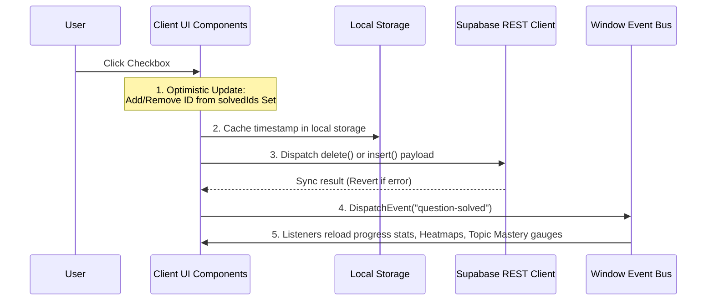

# Project Memory: ARCHITECTURE.md (Application Architecture)

This document details the architectural layers, routing design, component organization, and data propagation flows in SheetStride.

---

## 1. Application Architecture
SheetStride is built as a single-page progressive web application leveraging the **Next.js App Router** framework.
```text
┌────────────────────────────────────────────────────────┐
│                      Client Layer                      │
│   (React Client Components / Framer Motion Animation)  │
└───────────┬────────────────────────────────┬───────────┘
            │                                │
  API Calls │ (REST API)           Supabase  │ (Realtime / HTTP)
            ▼                                ▼
┌─────────────────────────┐      ┌───────────────────────┐
│       Next.js API       │      │  Supabase PostgreSQL  │
│  (Razorpay Order/Verify)│      │  (RLS Tables & Views) │
└─────────────────────────┘      └───────────────────────┘
```

*   **RSC vs. Client Components:** Page data requirements (such as listing unique company summaries or compiling static pattern parameter lists) are fetched from Supabase at build time or using React Server Components. Interactive state (grids, search boxes, progress checklists) is hydrated on the client via Client Components (`"use client"`).
*   **Context Isolation:** High-level state (like user auth profile details) is managed by standard React Context providers wrapped at the root (`app/layout.tsx`).

---

## 2. Routing Architecture
*   `app/page.tsx` - Static Landing page (public).
*   `app/login/page.tsx` - Authentication access point (public).
*   `app/(app)/` - Protected group routes governed by `middleware.ts`.
    *   `/dashboard` - User personal dashboard (visual graphs).
    *   `/profile` - Redesigned profile with LeetCode status split.
    *   `/progress` - Activity calendar and detailed distribution metrics.
    *   `/questions` - Questions hub (entry points to Core, Database, Company Sheets).
    *   `/questions/leetcode-universe` - Infinite problem grid.
    *   `/questions/sheetstride-core` - Curved topic roadmap.
    *   `/questions/company-sheets` - Listing page for company-wise lists.
    *   `/questions/company-sheets/[slug]` - Frequency-sorted questions checklist.
*   `app/patterns/[slug]` - Dynamic static routes compiling SEO patterns handbook.
*   `app/topics/[topic]` - Dynamic routes mapping question categories.

---

## 3. Component Architecture
*   **Layout Components:**
    *   `AppShell` (`components/app/shell.tsx`): Integrates sidebar navigation, upper status bars, user identity blocks, and grids.
    *   `Topbar` (`components/app/topbar.tsx`): Displays notifications, search overlays, and checkout access.
*   **Shared Visualization Components:**
    *   `Heatmap` (`components/shared/heatmap.tsx`): Calendar grid displaying problem-solving history.
    *   `Breadcrumbs` (`components/shared/breadcrumbs.tsx`): Clean uppercase folder-style navigator.
*   **Feature-Specific Components:**
    *   `PatternQuestionsClient` (`app/patterns/[slug]/pattern-questions-client.tsx`): Manages solve checks, toast logs, and offline local storage fallback.

---

## 4. Authentication Flow
1.  **Identity Verification:** Users trigger login via GitHub/Google OAuth or request a passwordless verification pin (OTP) via Magic Link.
2.  **Session Persistence:** Supabase Auth writes tokens to browser cookies (`sb-access-token` and `sb-refresh-token`).
3.  **Route Protection:** The `middleware.ts` interceptor monitors restricted routes (`/dashboard`, `/profile`, `/settings`). If the access token is invalid or expired, it automatically requests a token refresh via Supabase REST endpoints using the refresh token. If both are invalid, it redirects the user back to the landing page (`/`).
4.  **Client Hydration:** The React Context Auth Provider (`components/providers/auth-provider.tsx`) reads the session on mount and propagates the `user` object to all client components.

---

## 5. State & Data Flow
When a user marks a question as completed, the application uses an **optimistic update pattern** to ensure fluid interaction (60fps feedback), followed by background synchronization:


This event-driven reload ensures that solve checks in LeetCode Universe, Company Sheets, or Core Roadmaps instantly update global metrics across the entire application interface.
